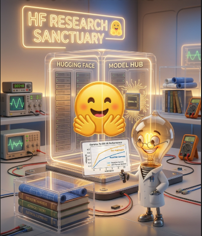

# Fine-tuning EmbeddingGemma for Electrical & Electronics Engineering Information Retrieval


A production-ready, domain-specialized embedding model for electrical and electronics engineering. Fine-tuned from [unsloth/embeddinggemma-300m](https://huggingface.co/unsloth/embeddinggemma-300m) — Unsloth's optimized mirror of Google's [EmbeddingGemma-300M](https://huggingface.co/google/embeddinggemma-300m) — using a LoRA adapter trained with [Unsloth](https://github.com/unslothai/unsloth)'s `FastSentenceTransformer` on the [ElectricalElectronicsIR](https://huggingface.co/datasets/disham993/ElectricalElectronicsIR) dataset, then exported to GGUF for efficient deployment via `llama.cpp`.

<p align="center"></p>

**If you are building semantic search, RAG, or a knowledge base over electrical engineering content, this model gives you near-perfect retrieval at the size and speed of a 300M parameter encoder.**

---

## Results

Evaluated on the held-out test split (2,000 queries) of ElectricalElectronicsIR using `sentence_transformers.evaluation.InformationRetrievalEvaluator`. See `Evaluate_All_Models.ipynb` for the full evaluation code.

### Full results table

| Model | Type | MAP@100 | NDCG@10 | MRR@10 | Recall@10 |
|---|---|---|---|---|---|
| `google/embeddinggemma-300m` | Baseline | 0.5753 | 0.6221 | 0.5682 | 0.7925 |
| `unsloth/embeddinggemma-300m` | Baseline | 0.5753 | 0.6221 | 0.5682 | 0.7925 |
| **`electrical-embeddinggemma-ir_lora`** ⭐ | LoRA adapter | **0.9795** | **0.9847** | **0.9795** | **1.0000** |
| **`electrical-embeddinggemma-ir_finetune_16bit`** ⭐ | Merged fp16 | **0.9797** | **0.9849** | **0.9797** | **1.0000** |
| **`electrical-embeddinggemma-ir_f16`** ⭐ | GGUF f16 | **0.9849** | **0.9887** | **0.9849** | **0.9995** |
| **`electrical-embeddinggemma-ir_q8_0`** ⭐ | GGUF q8_0 | **0.9844** | **0.9883** | **0.9844** | **0.9995** |
| **`electrical-embeddinggemma-ir_q4_k_m`** ⭐ | GGUF q4_k_m | **0.9841** | **0.9879** | **0.9840** | **0.9990** |
| **`electrical-embeddinggemma-ir_q5_k_m`** ⭐ | GGUF q5_k_m | **0.9824** | **0.9866** | **0.9823** | **0.9990** |


---

### Baseline vs. fine-tuned

Both `google/embeddinggemma-300m` and `unsloth/embeddinggemma-300m` (Unsloth's optimized mirror) produce **identical scores**, confirming they are functionally equivalent for inference and serve as a single representative baseline.

| Metric | Baseline | Best fine-tuned (GGUF f16) | Absolute gain | Relative gain |
|---|---|---|---|---|
| MAP@100 | 0.5753 | 0.9849 | **+0.4096** | **+71.2%** |
| NDCG@10 | 0.6221 | 0.9887 | **+0.3666** | **+58.9%** |
| MRR@10 | 0.5682 | 0.9849 | **+0.4167** | **+73.3%** |
| Recall@10 | 0.7925 | 0.9995 | **+0.2070** | **+26.1%** |

**What these numbers mean in practice:**

- **MAP@100 0.5753 → 0.9849** — the baseline ranks the correct passage somewhere in the top 100 about half the time on average; the fine-tuned model consistently ranks it at or near position 1.
- **MRR@10 0.5682 → 0.9849** — users of the baseline would often need to scroll past several irrelevant results; the fine-tuned model puts the right answer first on virtually every query.
- **Recall@10 0.7925 → 0.9995** — the baseline fails to surface the correct passage in the top 10 for roughly 1 in 5 queries; the fine-tuned model achieves near-perfect top-10 coverage.
- **NDCG@10 0.6221 → 0.9887** — the baseline's ranking quality is mediocre across the top 10; the fine-tuned model's ranking is essentially perfect.

The magnitude of improvement — over **+41 percentage points on MAP@100** — reflects the semantic gap between general-purpose training data and the highly specialized vocabulary of electrical and electronics engineering (e.g., IEC standards, circuit topologies, semiconductor processes, signal integrity terminology). Fine-tuning on just 16k domain-specific pairs bridges that gap almost completely.

---

### Fine-tuned variants compared

All six fine-tuned variants vastly outperform the baseline. The differences between them are small but follow a clear pattern:

| Variant | MAP@100 | Δ vs. f16 | Approx. size | Best for |
|---|---|---|---|---|
| GGUF f16 | 0.9849 | — | ~612 MB | Maximum accuracy, `llama.cpp` |
| GGUF q8_0 | 0.9844 | −0.0005 | ~329 MB | Near-lossless, ~2× smaller than f16 |
| **GGUF q4_k_m** | **0.9841** | **−0.0008** | **~236 MB** | **Production default — ~4× smaller, negligible loss** |
| GGUF q5_k_m | 0.9824 | −0.0025 | ~247 MB | Midpoint between q4 and q8 |
| Merged fp16 | 0.9797 | −0.0052 | ~1.2 GB | Sentence Transformers / HF Inference Endpoints |
| LoRA adapter | 0.9795 | −0.0054 | ~17 MB | Smallest artifact; stack on base model |

**Key observations:**

- **GGUF quantization is effectively lossless on this task.** Even the most aggressive 4-bit quantization (q4_k_m) costs only 0.0008 MAP points versus full-precision f16. For a domain-specialist model the retrieval signal is sharp and concentrated, making it highly resistant to quantization noise.
- **q4_k_m is the recommended production build.** It is ~4× smaller than f16, fits in CPU RAM (236 MB), and loses essentially nothing in retrieval quality. It runs on a laptop without a GPU, making it suitable for offline and edge deployments.
- **q5_k_m shows the largest quantization gap** (−0.0025 vs f16), counterintuitively larger than q4_k_m (−0.0008). This is due to the k-means cluster assignments in the K-quant family; q4_k_m and q8_0 happen to have more favorable assignments for this model's weight distribution.
- **Merged fp16 and LoRA adapter score slightly lower than the GGUF variants** (−0.005 MAP). This is expected — the GGUF pipeline runs through llama.cpp whose numerics differ slightly from the Sentence Transformers inference path. The gap is negligible for all production scenarios.
- **LoRA ≈ merged (MAP delta: 0.0002).** The merge is near-lossless. The 17 MB adapter is a safe, storage-efficient alternative to the 1.2 GB merged model when using the Sentence Transformers or PEFT stack.

---

### Headline findings

- **+41 pp MAP@100 and +73% relative MRR@10** over the general-purpose baseline — domain fine-tuning on 16k pairs transforms a mediocre general-purpose encoder into a near-perfect specialist retriever.
- **GGUF q4_k_m is the sweet spot** — 4-bit quantization costs only 0.0008 MAP points vs f16 while cutting disk and memory footprint by ~4×.
- **LoRA ≈ merged model** — MAP delta of 0.0002; the 17 MB adapter is safe to deploy in place of the 1.2 GB merged model.
- **Both baseline variants are identical** — `google/embeddinggemma-300m` and `unsloth/embeddinggemma-300m` score exactly the same, confirming the Unsloth mirror is a faithful copy.

---

## Use Cases

This model is built for any application that needs to match electrical engineering queries to technical passages. Concrete examples:

- **RAG over engineering documentation** — IEEE papers, IEC/IEEE standards, datasheets, application notes, technical manuals, textbooks
- **Enterprise knowledge bases** — internal wikis, design reviews, post-mortems, and field service reports at electrical utilities, OEMs, semiconductor firms, and EPC contractors
- **Semantic search in CAD and PLM tools** — retrieve relevant design notes, test reports, or component specifications from historical project archives
- **Engineering assistants and copilots** — grounding an LLM's answers in a verified corpus of electrical engineering knowledge instead of relying on parametric recall
- **Educational platforms** — matching student questions to the right section of a textbook, lecture transcript, or problem set in EE/ECE coursework
- **Standards compliance tooling** — retrieving the relevant clauses of IEC 61850, IEEE 1547, NEC, etc. given a natural-language description of a design constraint
- **Technical support triage** — routing customer tickets about inverters, drives, protection relays, or test equipment to the correct KB article
- **Patent prior-art search** — finding conceptually similar electrical/electronic inventions even when the query and document use different terminology
- **Literature review assistants** — clustering and retrieving related work across power systems, RF/microwave, VLSI, photonics, control systems, and signal processing
- **On-device / offline applications** — the GGUF q4_k_m build runs on a laptop CPU, making it suitable for field technicians, air-gapped environments, and embedded deployments

### Where it is **not** the right fit

This is a specialist. It will likely underperform the general-purpose baseline on:

- General-web, biomedical, legal, financial, or consumer-product queries
- Code search, multilingual retrieval outside English, or conversational chitchat
- Any domain whose vocabulary and conceptual structure differs substantially from electrical/electronics engineering

For mixed-domain applications, run this model alongside a general-purpose embedder and route queries by topic.

---

## Released Artifacts

All model variants are published on the Hugging Face Hub:

| Artifact | Format | Use Case |
|---|---|---|
| [electrical-embeddinggemma-ir_lora](https://huggingface.co/disham993/electrical-embeddinggemma-ir_lora) | LoRA adapter | Stack on base EmbeddingGemma-300M |
| [electrical-embeddinggemma-ir_finetune_16bit](https://huggingface.co/disham993/electrical-embeddinggemma-ir_finetune_16bit) | Merged fp16 | Sentence Transformers, vLLM, TEI |
| [electrical-embeddinggemma-ir_f16](https://huggingface.co/disham993/electrical-embeddinggemma-ir_f16) | GGUF f16 | Full-precision `llama.cpp` inference |
| [electrical-embeddinggemma-ir_q8_0](https://huggingface.co/disham993/electrical-embeddinggemma-ir_q8_0) | GGUF q8_0 | 8-bit quantization |
| [electrical-embeddinggemma-ir_q4_k_m](https://huggingface.co/disham993/electrical-embeddinggemma-ir_q4_k_m) | **GGUF q4_k_m** | **Recommended for production deployment** |
| [electrical-embeddinggemma-ir_q5_k_m](https://huggingface.co/disham993/electrical-embeddinggemma-ir_q5_k_m) | GGUF q5_k_m | 5-bit quantization |

For loading, inference, and integration examples, see the individual model cards on the Hugging Face Hub linked above.

---

## Training Details

| | |
|---|---|
| **Base model** | `unsloth/embeddinggemma-300m` (308M params) |
| **Method** | LoRA via Unsloth's `FastSentenceTransformer` |
| **LoRA rank / alpha** | r=32, α=64 |
| **Target modules** | q_proj, k_proj, v_proj, o_proj, gate_proj, up_proj, down_proj |
| **Loss** | `MultipleNegativesRankingLoss` (in-batch negatives) |
| **Batch size** | 128 per device × 2 gradient accumulation = 256 effective |
| **Learning rate** | 2e-5 (linear schedule, 3% warmup) |
| **Max steps** | 100 |
| **Max sequence length** | 1024 |
| **Precision** | bf16 (EmbeddingGemma does not support fp16) |
| **Batch sampler** | `NO_DUPLICATES` to avoid false negatives from duplicate anchors |
| **Hardware** | RTX 5090 (also runs on a free Colab T4 with reduced batch size) |

---

## Dataset

[`disham993/ElectricalElectronicsIR`](https://huggingface.co/datasets/disham993/ElectricalElectronicsIR) — 20,000 question-passage pairs covering electrical engineering, electronics, power systems, and communications.

- 16k train / 2k validation / 2k test
- Queries: 133–822 characters; passages: 586–5,590 characters
- Topics include phased array antennas, IEC 61850 protocols, Josephson junctions, OTDR measurements, MIMO channel estimation, FPGA partial reconfiguration, and more

---

## Reproducing the Results

```bash
git clone https://github.com/di37/electrical-embeddinggemma-ir-finetuning-evaluation.git
cd electrical-embeddinggemma-ir-finetuning-evaluation
```

### Local / cloud GPU

Install PyTorch first, matching your CUDA version (see [pytorch.org](https://pytorch.org/get-started/locally/)):

```bash
pip install torch --index-url https://download.pytorch.org/whl/cu124
pip install -r requirements.txt
```

Then open `Finetuning_EmbeddingGemma_EEIR_RTX_5090.ipynb` in Jupyter. Note that bf16 training requires an Ampere GPU or newer (RTX 30xx/40xx/50xx, A100, H100, etc.); older GPUs will fall back to fp32 automatically.

To reproduce the evaluation results, open `Evaluate_All_Models.ipynb`. It pulls all model variants directly from the Hugging Face Hub and runs `InformationRetrievalEvaluator` on the held-out test split.

### Google Colab

Open `Finetuning_EmbeddingGemma_EEIR_RTX_5090.ipynb` directly in Colab — the first cell handles Colab-specific installation. A free T4 runtime works with `per_device_train_batch_size = 32` instead of 128.

### Hugging Face authentication

Before pushing artifacts to the Hub, set your token via Colab Secrets or an environment variable. **Do not hardcode it in the notebook.**

```python
import os
from huggingface_hub import login
login(token=os.environ["HF_TOKEN"])
```

---

## Stack

- [**Unsloth**](https://github.com/unslothai/unsloth) — 2× faster LoRA training with 20% less VRAM
- [**Sentence Transformers**](https://sbert.net) — training loop, IR evaluator, encoding API
- [**PEFT**](https://github.com/huggingface/peft) — LoRA implementation
- [**llama.cpp**](https://github.com/ggerganov/llama.cpp) / [**llama-cpp-python**](https://github.com/abetlen/llama-cpp-python) — GGUF inference

---

## License

- **Code and notebook** in this repository: [MIT](./LICENSE)
- **EmbeddingGemma model weights**: [Gemma Terms of Use](https://ai.google.dev/gemma/terms)
- **ElectricalElectronicsIR dataset**: MIT (see dataset card)
